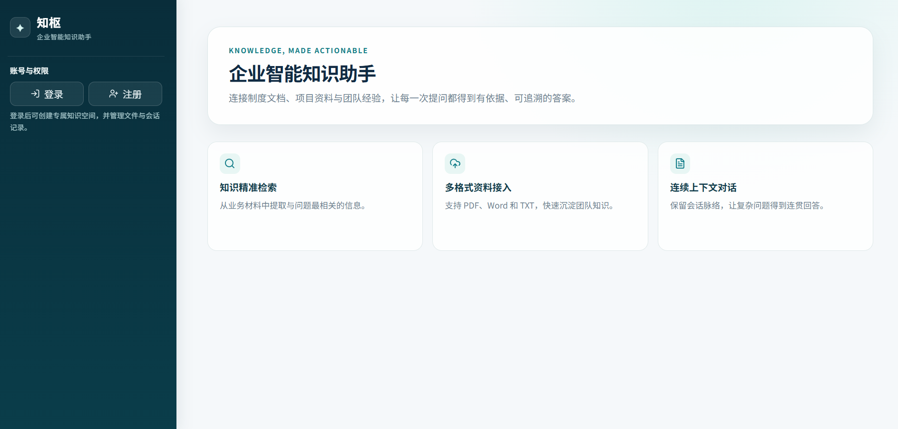
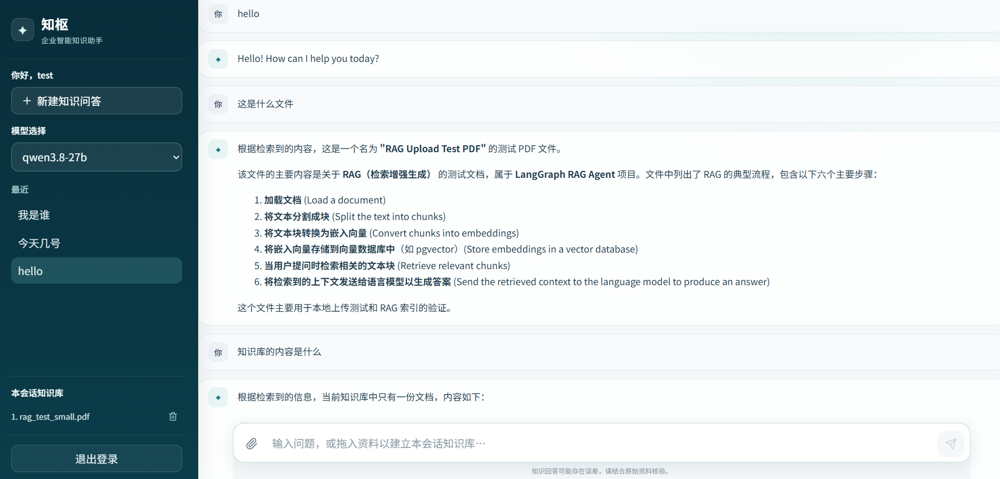

# 知枢（ZhiShu）—— 企业智能知识助手

> 将企业文档、对话线程与 AI Agent 放在同一个可控的知识问答工作台中。

知枢是一个面向内部知识检索与智能问答的全栈项目。用户可以按对话线程上传 PDF、DOCX、TXT 文档，使用流式 AI 对话获得基于资料的回答；管理员则在独立后台中管理用户、文档和审计记录。

项目从产品界面、后端 API、知识检索到部署配置均在本仓库内实现，README 内容以当前代码为准。



## 核心能力

- **智能体式知识问答**：以 LangGraph ReAct Agent 编排文档检索与联网搜索工具，并通过 NDJSON 持续返回生成内容和工具事件。
- **混合检索**：将 pgvector 语义检索与 BM25L 关键词检索通过加权 RRF 融合，兼顾语义表达、中文文本和精确关键词。
- **严格的数据隔离**：文档检索、会话读取和删除操作均在后端按 `user_id + thread_id` 校验；不能仅凭前端参数访问他人的数据。
- **线程化知识空间**：每个线程都有独立的对话历史、文档集合与向量数据；删除线程会同步清理对应的持久化状态和向量内容。
- **可靠的登录会话**：访问令牌仅留在前端内存中，刷新令牌以轮换的 HttpOnly Cookie 保存；用户端与管理端会话彼此独立。
- **双端 React 界面**：用户端提供对话、线程和文档管理；管理端提供用户、文档、密码重置和审计日志管理。
- **请求治理**：基于 Redis 的滑动窗口限流覆盖普通接口、登录注册、上传和 Agent 请求；对成本敏感接口在限流组件不可用时采用拒绝策略。

## 技术架构

```text
React 用户端 / React 管理端
            │
            ▼
       FastAPI API
   ┌────────┼─────────┐
   ▼        ▼         ▼
认证会话  LangGraph   文件处理
   │        │         │
   ▼        ▼         ▼
PostgreSQL  pgvector + BM25L  Redis
  用户、线程、检查点  向量与关键词索引  限流计数
```

| 层级 | 主要实现 |
| --- | --- |
| 前端 | React 19、TypeScript、Vite、TanStack Query、React Router |
| 后端 | FastAPI、SQLAlchemy Async、Pydantic Settings |
| Agent 与检索 | LangGraph、LangChain、OpenAI 兼容模型接口、Tavily（可选） |
| 数据与基础设施 | PostgreSQL 16、pgvector、Redis 7、Docker Compose、Nginx |

## 快速开始

### 运行条件

- Docker Desktop（推荐使用 Compose 一键运行）
- 一个兼容 OpenAI API 的模型/Embedding 配置
- 可选：Tavily API Key，用于 Agent 的联网搜索工具

### 1. 创建本地配置

仓库仅提供可公开的配置模板，不提交真实密钥。

```powershell
Copy-Item env.example .env
```

编辑 `.env`，至少按所选模型服务填写 `OPENAI_API_KEY` 或 `DEEPSEEK_API_KEY`、`MODEL_PROVIDER`、`MODEL_NAMES`、`EMBEDDINGS_MODEL_NAME`、`JWT_SECRET` 与数据库密码。生产环境还应设置明确的 `FRONTEND_ORIGINS` 并将 `COOKIE_SECURE=true`。

### 2. 启动完整服务

```powershell
docker compose up -d --build
docker compose ps
```

默认入口：

| 服务 | 地址 |
| --- | --- |
| 用户端 | http://localhost:8501 |
| 管理端 | http://localhost:8502 |
| 后端 OpenAPI 文档 | http://localhost:8000/api/v1/docs |
| PostgreSQL | `localhost:5432` |

如端口已被占用，可在 `.env` 中调整 `FRONTEND_PORT`、`ADMIN_PORT`、`BACKEND_HOST_PORT`、`POSTGRES_HOST_PORT` 后重新启动。查看运行日志：

```powershell
docker compose logs -f backend
```

停止服务但保留数据卷：

```powershell
docker compose down
```

## 使用流程

1. 在用户端注册或登录，创建一个对话线程。
2. 向该线程上传 PDF、DOCX 或 TXT 文档，等待系统完成切分与索引。
3. 在对话框中提问；Agent 会根据需要调用线程内知识检索或联网搜索。
4. 生成过程以流式方式显示，工具调用和检索结果会随消息一同返回。
5. 管理员登录独立管理端，进行用户、文档与审计记录维护。



## 本地开发

### 后端

后端位于 `backend/`。本地运行前，请确保 `.env` 中的 PostgreSQL、Redis 与模型服务地址能从主机访问。

```powershell
python -m venv .venv
.\.venv\Scripts\Activate.ps1
pip install -r backend\requirements.txt
uvicorn app.main:app --app-dir backend --reload --port 8000
```

### 前端

前端采用 npm workspace，用户端和管理端共享 API 客户端、类型和基础组件。

```powershell
Set-Location web
npm install
npm run dev:user    # http://localhost:5173
npm run dev:admin   # http://localhost:5174
```

开发模式下，请在 `.env` 的 `FRONTEND_ORIGINS` 中加入实际使用的前端地址。

## 配置说明

完整字段请见 [env.example](env.example)。以下配置最常需要调整：

| 配置 | 用途 |
| --- | --- |
| `MODEL_PROVIDER` / `MODEL_NAMES` | 选择聊天模型服务与可用模型 |
| `EMBEDDINGS_MODEL_NAME` | 文档向量化使用的 Embedding 模型 |
| `HYBRID_*` | 控制向量检索、BM25 候选数和加权 RRF 融合策略 |
| `POSTGRES_*` / `PGVECTOR_COLLECTION_NAME` | PostgreSQL 与向量集合配置 |
| `REDIS_URL` / `RATE_LIMIT_*` | Redis 连接与各类接口的限流阈值 |
| `SUPER_ADMIN_EMAILS` | 指定可查看审计日志的超级管理员邮箱列表 |
| `COOKIE_SECURE` / `COOKIE_SAMESITE` | 刷新 Cookie 的浏览器安全策略 |

不要将 `.env`、私钥、账户凭据或真实 API Key 提交到仓库。发布前请使用 `git status` 和 `git diff --cached` 检查待提交内容。

## 项目结构

```text
backend/
  app/                    # FastAPI、认证、会话、Agent、检索、管理接口
  tests/                  # 后端与隔离/限流/向量归属测试
web/
  apps/user/              # 用户端 React 应用
  apps/admin/             # 管理端 React 应用
  packages/shared/        # 共享 API 客户端、类型与组件
  e2e/                    # Playwright 端到端测试
screenshots/              # README 界面截图
docker-compose.yml        # PostgreSQL、Redis、后端、用户端和管理端编排
env.example               # 无敏感信息的环境变量模板
```

## 开发验证

```powershell
# 前端单元测试、类型检查和构建
Set-Location web
npm test
npm run typecheck
npm run build

# 后端测试（需要可用的测试数据库环境）
Set-Location ..
docker compose -f docker-compose.test.yml up --build --abort-on-container-exit --exit-code-from backend-test
```

针对真实模型服务的测试可能产生 API 调用和费用，应在明确配置密钥并确认测试范围后执行。

## 许可证

本项目采用 [MIT License](LICENSE)。
