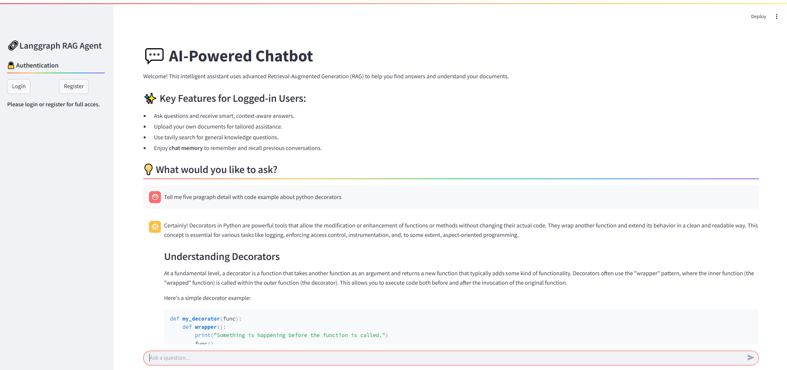

# 🤖 LangGraph RAG Agent

An agentic Retrieval-Augmented Generation (RAG) system built with **FastAPI**, **LangGraph**, and **React**, featuring NDJSON streaming responses and a **PostgreSQL + pgvector** vector store. It includes separate user and administrator applications, secure refresh-cookie sessions, persistent threaded memory, and tool-augmented reasoning (document retrieval + web search).

## 🚀 Features

- **Agentic RAG with LangGraph**: ReAct-style agent with tools for document retrieval and web search
- **Streaming responses end-to-end**: Real-time NDJSON token and tool events in the React UI
- **Threaded conversations**: Per-user threads with persistent histories stored via Postgres checkpointers
- **PostgreSQL + pgvector**: Vector storage and semantic retrieval over user-uploaded documents
- **Secure sessions and RBAC**: In-memory access tokens, rotating HttpOnly refresh cookies, and separate administrator sessions
- **Document ingestion**: PDF, DOCX, and TXT support with chunking and async indexing
- **Tooling**: Built-in `retrieve_user_documents` and Tavily web search integration
- **Async-first backend**: FastAPI + SQLAlchemy 2.0 async, production-ready logging and healthchecks

## 💻 Tech Stack

- **Backend**: FastAPI, LangGraph, LangChain, SQLAlchemy, Pydantic v2
- **Vector Store**: PostgreSQL + pgvector (via `langchain-postgres`)
- **Checkpointer**: LangGraph Postgres Checkpointer (async)
- **Frontend**: React, TypeScript, Vite, TanStack Query, React Router, Nginx
- **LLM/Embeddings**: OpenAI-compatible models (configurable base URLs)

## 📋 Prerequisites

- Python 3.12+
- Docker and Docker Compose (recommended for Postgres + full stack)

## 📦 Quick Start (Docker Compose)

1. Copy environment template and edit values:
   ```bash
   cp env.example .env
   ```
2. Start the full stack:
   ```bash
   docker compose up --build
   ```

Services:
- User app: `http://localhost:8501`
- Admin app: `http://localhost:8502`
- Backend API: `http://localhost:8000/api/v1` (or `BACKEND_HOST_PORT`)
- API Docs: `http://localhost:8000/api/v1/docs`

Notes:
- The `pgvector/pgvector:pg16` image includes the `vector` extension. If you use your own Postgres, ensure `CREATE EXTENSION IF NOT EXISTS vector;` is enabled.
- Nginx serves each React build and proxies `/api`, so production browsers do not need the backend host port.
- Run independent React previews without replacing `8501/8502`:
  ```bash
  docker compose -f docker-compose.yml -f docker-compose.preview.yml --profile preview up -d --build frontend-preview admin-preview
  ```
The previews default to `8511/8512`; check port ownership first and do not stop unrelated processes.

On Windows, run the read-only preflight before starting previews:

```powershell
.\scripts\check-preview-ports.ps1
```

## 🧰 Local Development

### 1) Backend (FastAPI)

```bash
cd backend
python -m venv .venv
.venv/Scripts/activate     # Windows
# source .venv/bin/activate  # Linux/macOS
pip install -r requirements.txt
```

Ensure a Postgres instance is running with pgvector. Example (Docker):
```bash
docker run --name langgraph_postgres -p 5432:5432 \
  -e POSTGRES_USER=postgres -e POSTGRES_PASSWORD=test -e POSTGRES_DB=langgraph_db \
  -d pgvector/pgvector:pg16
```

Run the API:
```bash
uvicorn app.main:app --reload --host 0.0.0.0 --port 8000 --reload-dir ./app
```

### 2) Frontends (React)

```bash
cd web
npm install
npm run dev:user   # http://localhost:5173
npm run dev:admin  # http://localhost:5174 (run in another terminal)
```

Useful checks are `npm run typecheck`, `npm test`, and `npm run build`. The Playwright groups are `test:e2e:non-ai`, `test:e2e:admin`, `test:e2e:real-ai`, and `test:e2e:mobile`; the workspace shares API, types, and base components between both applications.

Run backend integration tests against an isolated temporary PGVector database, never the business database:

```bash
docker compose -f docker-compose.test.yml up --build --abort-on-container-exit --exit-code-from backend-test backend-test
```

Any E2E suite that writes data must use `docker-compose.e2e.yml`. It runs under a separate Compose project and stores PostgreSQL data in tmpfs. Set all six `E2E_USER_*`, `E2E_ADMIN_*`, and `E2E_SUPER_ADMIN_*` account variables in the current shell, then run:

```bash
./scripts/run-isolated-acceptance.ps1
```

The real model and embedding path additionally requires `E2E_REAL_AI=1`, provider/model/embedding variables, and a real provider credential; absence is an environment-blocked nonzero result, never a skip. The unified runner uses a unique Compose project and tmpfs then removes only that project's containers and network. Never put credentials in source or command output.

Run `scripts/start-preview-after-acceptance.ps1` and `scripts/verify-preview.ps1` before any manually reviewed preview release.

## 🔧 Environment Variables

Create a project-root `.env` (both backend and frontend read from it). Key settings:

Core LLM settings:
- `OPENAI_API_KEY`
- `MODEL_PROVIDER` (e.g., `openai`)
- `MODEL_NAMES` (JSON list, e.g., `["gpt-4o", "gpt-4o-mini"]`)
- `MODEL_BASE_URL` (optional for OpenAI-compatible endpoints)
- `EMBEDDINGS_MODEL_NAME` (e.g., `text-embedding-3-large`)
- `EMBEDDINGS_BASE_URL` (optional)
- `TAVILY_API_KEY` (for web search tool)

Auth and tokens:
- `TOKEN_BEARER_URL` (default `/api/v1/auth/login`)
- `JWT_SECRET` (use a strong, random value)
- `JWT_ALGORITHM` (e.g., `HS256`)
- `ACCESS_TOKEN_EXPIRY_MINS` (e.g., `1440`)
- `REFRESH_TOKEN_EXPIRY_DAYS` (e.g., `1`)
- `FRONTEND_ORIGINS` (explicit JSON allowlist for local cross-origin development)
- `COOKIE_SECURE` (`true` behind production HTTPS)
- `COOKIE_SAMESITE` (default `lax`)
- `REFRESH_COOKIE_NAME` / `ADMIN_REFRESH_COOKIE_NAME`

Database and vector store:
- `POSTGRES_HOST` (e.g., `127.0.0.1` or `postgres` in Docker)
- `POSTGRES_PORT` (e.g., `5432`)
- `POSTGRES_USER` (e.g., `postgres`)
- `POSTGRES_PASSWORD` (e.g., `test`)
- `POSTGRES_DATABASE` (e.g., `langgraph_db`)
- `PGVECTOR_COLLECTION_NAME` (e.g., `my_collection`)

Ports:
- `FRONTEND_PORT` / `ADMIN_PORT` (React defaults: `8501` / `8502`)

Example values are provided in `env.example`.

## 🧩 API Overview

Base URL: `/api/v1`

Auth:
- `POST /auth/signup`
- `POST /auth/login`
- `POST /auth/refresh-token`
- `POST /auth/logout`
- `POST /auth/admin/login`
- `POST /auth/admin/refresh-token`
- `POST /auth/admin/logout`

Public runtime config:
- `GET /config/public`

Users:
- `GET /users/me`
- `PUT /users/user-profile/{user_id}`
- `DELETE /users/user-profile/{user_id}`

Administration:
- `GET /admin/me`
- `GET /admin/overview`
- `GET /admin/health`
- `GET /admin/users`
- `PATCH /admin/users/{user_id}`
- `POST /admin/users/{user_id}/reset-password`
- `GET /admin/documents`
- `DELETE /admin/documents/{document_id}`
- `GET /admin/audit-logs` (super administrators only)

Threads:
- `POST /threads/` (create)
- `GET /threads/` (list)
- `GET /threads/{thread_id}` (get)
- `PATCH /threads/{thread_id}` (update title)
- `DELETE /threads/{thread_id}` (delete + cascade cleanup of memory and vectors)

Documents:
- `GET /documents/{thread_id}` (list)
- `POST /documents/upload/{thread_id}` (upload + async index)
- `DELETE /documents/{document_id}` (remove + delete chunks from pgvector)

Chat and streaming:
- `POST /chat/{thread_id}` (authenticated streaming agent with tools + memory)
- `GET /chat/{thread_id}` (retrieve persisted chat history)

API docs:
- Swagger UI: `http://localhost:8000/api/v1/docs`
- ReDoc: `http://localhost:8000/api/v1/redoc`

## 📡 Streaming Protocol

The chat streaming endpoint returns newline-delimited JSON events. Event types include:
- `llm_chunk`: incremental model output
- `tool_call`: tool name and arguments when the agent invokes a tool
- `tool_result`: tool output returned to the agent
- `error`: structured failure information after response streaming has started

Example stream (JSON lines):

```json
{"type":"tool_call","name":"retrieve_user_documents","args":{"query":"policy overview"}}
{"type":"tool_result","name":"retrieve_user_documents","content":"...retrieved text..."}
{"type":"llm_chunk","content":"Here is a summary of your policy..."}
```

## 🔄 Architecture

1. Ingestion & Indexing
   - PDF, DOCX, TXT loaders; chunking via `RecursiveCharacterTextSplitter`
   - Async indexing into pgvector using `langchain-postgres` with JSONB metadata

2. Retrieval
   - Semantic similarity search filtered by `thread_id` and `user_id`
   - Tool: `retrieve_user_documents` leverages the vector store retriever

3. Agent & Generation
   - LangGraph ReAct agent (`create_react_agent`) with tools (documents + Tavily)
   - Configurable models via `MODEL_NAMES`
   - End-to-end streaming

4. Memory
   - LangGraph Postgres checkpointer (async) stores per-thread chat histories
   - Thread deletion cleans up checkpointer state and related vector chunks

## 🖼️ Screenshots

### Unauthenticated Home Page


### Authenticated Home Page


## 📝 License

Licensed under the [MIT License](./LICENSE).

## 🤝 Contributing

Contributions are welcome! Please open an issue or submit a PR.


